# Phase-Shifted Full-Bridge DC-DC Converter (400 V to 13.5 V, 3 kW)

Design and SPICE verification of a phase-shifted full-bridge (PSFB) converter for a
400 VDC to 13.5 VDC, 3 kW rail. This is the same class of converter used as the
auxiliary DC-DC (LDC) in an electric vehicle, stepping the traction pack down to the
12 V system.

The power stage was sized by hand first, then verified in LTspice at 25%, 50% and 100%
load using real manufacturer device models rather than idealised switches.

The full write-up is reproduced below. A Word and PDF copy live in
[`report/`](report/), and the loss analysis script is in [`scripts/`](scripts/).

---

## Summary

The converter holds its output voltage across the whole load range. It achieves
zero-voltage switching on both bridge legs at 50% and 100% load, and loses it on the
lagging leg at 25% load. That last result is normal for this topology, and here it is
pinned down rather than just noted: the hand analysis and the simulated waveforms both
put the ZVS threshold between about 4.6 A and 7.2 A of primary current, which places
the real soft-switching floor near 40% load.

Two things came out of using the actual device datasheet instead of representative
values, and both matter more than the waveforms do. The secondary needs roughly eight
paralleled MOSFETs per rectifier position. A single device would burn 358 W and sit
five times over its current rating, which makes this converter a secondary-side problem
far more than a 400 V one. The ZVS timing margin is also thinner than a generic
capacitance figure suggests, with the dead time clearing the transition by about 15%
rather than the factor of three an assumed value implied.

One caveat belongs up front, because it changes how the primary-side results should be
read. The MOSFET model populating the primary bridge in the simulation is a 30 V device
sitting on a 400 V bus. The simulated behaviour is sound, but that part is a stand-in
and a real build needs a 650 V device there. This is covered properly below.

## 1. Objective

The task is to design and evaluate a phase-shifted full-bridge DC-DC converter taking
400 VDC to 13.5 VDC at 3 kW. At rated power the output current is about 222 A, and that
single number shapes most of what follows. Conduction loss and current handling on the
secondary dominate the design even though 3 kW is not a large power level.

I sized the major power stage parameters by hand first, then verified them in a
switching-level SPICE simulation. The model keeps the parasitics that actually govern
PSFB behaviour, meaning transformer leakage inductance, MOSFET output capacitance, body
diodes and the output filter, so the results reflect real switching behaviour rather
than an averaged approximation of it.

## 2. Specifications

| Parameter | Value |
|---|---|
| Input voltage | 400 VDC |
| Output voltage | 13.5 VDC |
| Rated output power | 3 kW |
| Rated output current | 222.2 A |
| Topology | Phase-shifted full bridge |

```
I_o = P_o / V_o = 3000 / 13.5 = 222.2 A
```

## 3. Assumptions

### 3.1 Input voltage

Nominal input is 400 VDC with an assumed variation of plus or minus 5%, giving a range
of 380 V to 420 V. The 380 V end is the one that matters, because it is the worst case
for how much phase shift is left before the converter runs out of range.

### 3.2 Secondary rectification

I chose a full-bridge secondary rectifier: one secondary winding feeding four devices
(D1 to D4) arranged as a bridge, rather than a center-tapped winding with two. At 222 A
the real implementation has to use synchronous rectification, since even a 0.4 V diode
drop would cost around 90 W per device. Diodes appear in the simulation only as a
modelling simplification.

The full-bridge choice has one cost worth flagging. Current always flows through two
rectifier devices in series instead of one, so reaching a given output voltage takes
slightly more phase shift than a center-tapped design at the same turns ratio would.
That is why the phase shift used at each load point sits higher than a first-pass
calculation suggests.

### 3.3 Switching devices

The simulation is built around a specific real part rather than a generic switch: the
Vishay Siliconix Si7336ADP, an N-channel MOSFET in a PowerPAK SO-8. Using a
manufacturer part matters here because the device's output capacitance sets the ZVS
threshold, and that turns out to be the most consequential number in the design.

| Si7336ADP parameter | Value | Conditions |
|---|---|---|
| Drain-source voltage | 30 V | |
| Continuous drain current | 30 A / 25 A | 25 °C / 70 °C |
| R_DS(on) | 2.4 mΩ typ | V_GS = 10 V |
| R_DS(on) | 3.1 mΩ typ | V_GS = 4.5 V |
| Total gate charge Q_g | 36 nC typ | V_GS = 4.5 V |
| Output capacitance C_oss | 860 pF | V_DS = 15 V |
| Input capacitance C_iss | 5600 pF | V_DS = 15 V |
| Body diode V_SD | 0.72 V typ | I_S = 2.9 A |
| R_thJA / R_thJC | 50 / 1.0 °C/W | steady state |

Before any of these numbers get used, one point has to be made plainly. The Si7336ADP
is a 30 V part, and the primary bridge runs from a 400 V bus. That is more than
thirteen times its rating. SPICE simulates it without complaint because the standard
MOSFET model has no avalanche breakdown in it, but a real device would fail the moment
the bridge was energised. The primary-side results here are valid as converter
behaviour; the part itself is a stand-in, not something you could build with.

The secondary is where this device genuinely belongs. It blocks the reflected input
voltage, 400/22 or about 18.2 V, so a 30 V rating leaves roughly 1.65 times margin.
That is reasonable if the layout is snubbed properly. Its 2.4 mΩ on-resistance is
exactly what you want with 222 A flowing.

### 3.4 Output ripple

The target is about 1% of nominal output voltage.

```
dV_o <= 0.01 (13.5) = 0.135 V
```

I used a tighter 100 mV figure while sizing the capacitor, to leave margin against ESR
effects that a pure charge-balance calculation misses.

### 3.5 Control

A closed loop would normally regulate output voltage by adjusting phase shift. For this
work I evaluated the power stage at fixed open-loop operating points instead, tuning the
phase shift at each load until the output settled near 13.5 V. That is standard practice
for characterising a power stage before designing a controller around it.

## 4. Converter design

### 4.1 Switching frequency: 100 kHz

Switching frequency trades magnetic size against switching loss. Raising it shrinks the
transformer, output inductor and capacitor, but raises switching and gate-drive losses.
The whole appeal of PSFB is that ZVS removes most of the turn-on loss that would
otherwise scale with frequency, which is what makes 100 kHz comfortable here where a
hard-switched bridge would struggle.

```
T_s = 1 / f_s = 10 us
```

A 150 ns dead time is about 1.5% of the period, small enough not to eat meaningfully
into the available duty cycle.

### 4.2 Turns ratio: 22:1

With a full-bridge secondary, N_s is simply the single winding's turn count, and that
winding carries current on both half-cycles. The binding constraint is the duty-cycle
budget at minimum input voltage. Leaving headroom for leakage duty loss and other drops
means the maximum commanded duty should stay below roughly 0.83.

```
n = (380 x 0.83) / 13.8 = 22.8
```

I settled on 22:1, which is about 44 primary turns to 2 secondary turns. Two turns is
roughly as low as a real secondary winding can practically go. At the nominal 400 V
input the required effective duty works out near 0.76.

### 4.3 Output inductor: 0.4 uH

Sized with the standard buck-derived ripple formula at twice the switching frequency,
since the full-bridge rectifier delivers a pulse on both half-cycles.

```
dI_L = V_o (1 - D) / [L_o (2 f_s)]
```

Targeting roughly 20% ripple on the rated output current gives about 44.4 A peak to
peak, and solving for inductance gives 0.37 uH. I rounded to 0.4 uH, which gives about
40.7 A of ripple in practice. The inductance is small, but building an inductor that
carries more than 200 A of DC without excessive copper and core loss is the real
engineering problem here, not the value itself.

### 4.4 Output capacitor: about 1500 uF

Charge balance alone calls for only 254 uF. In practice, at this ripple current the ESR
of the bank contributes at least as much ripple as the ideal capacitance term, and the
bank also has to absorb load-transient energy that charge balance ignores. I used a
1500 uF low-ESR bank to leave real transient margin.

### 4.5 Leakage inductance: 4 uH

This is the parameter that makes ZVS work, and it carries the sharpest trade-off in the
design. During each dead time neither switch on a leg is driven, so the current stored
in the leakage inductance is what charges and discharges the MOSFET output capacitances
and swings the switch node to the opposite rail. With enough current the node reaches
the rail before the incoming gate is asserted, and that device turns on into roughly
zero volts.

There are two standard ways to write the condition, and they do not agree. The first is
a charge balance. The leakage current has to move enough charge to swing both devices'
output capacitance across the full bus, and it only has the dead time to do it in:

```
I_min >= 2 C_oss V_in / t_d = 2 (860 pF)(400 V) / 150 ns = 4.6 A
```

The second is an energy balance, asking whether the inductor has stored enough energy
to complete a full resonant swing to the opposite rail:

```
I_min >= V_in sqrt(2 C_oss / L_lk) = 400 sqrt(1.72 nF / 4 uH) = 8.3 A
```

Neither is wrong. They describe two limiting cases. The charge form assumes current
stays roughly constant through the transition; the energy form assumes a fully
developed resonance. Which applies depends on how the resonant period compares with the
dead time, and here they sit uncomfortably close. The quarter-period of L_lk ringing
against 2 C_oss is about 130 ns against a 150 ns dead time. The swing completes, but
only just, so the real threshold lands somewhere between 4.6 A and 8.3 A rather than at
either bound.

The simulation brackets the same threshold independently and more tightly. ZVS is clean
at 50% load, where the transition current is 7.18 A, and lost at 25% load, where it is
3.53 A. Putting both brackets together, the true threshold for this converter is
between roughly 4.6 A and 7.2 A.

This is also the clearest reason the real device data was worth chasing down. An
earlier version of this design assumed a generic 200 pF output capacitance, which puts
the charge-balance threshold near 1.1 A. That would predict comfortable ZVS at every
load point and well below, flatly contradicting what the waveforms show. The
Si7336ADP's real 860 pF is what brings the hand analysis and the simulation into
agreement.

### 4.6 Dead time: 150 ns

Dead time has to outlast the transition, or the devices hard-switch no matter how
carefully the leakage inductance was sized. With the real output capacitance, the
governing figure is the resonant quarter-period:

```
t_transition = (pi/2) sqrt(L_lk x 2 C_oss) = (pi/2) sqrt(4 uH x 1.72 nF) = 130 ns
```

At 150 ns the dead time clears that by about 15%. That is much tighter than the earlier
200 pF assumption implied, where the transition looked like roughly 60 ns and 150 ns
seemed generous. It is not generous, it is adequate, and the 50% load case is visibly
close to the edge because of it.

Widening the margin is not free either. Too little dead time risks shoot-through and
hard switching; too much increases body-diode conduction loss and eats into the
power-transfer interval, which this design cannot spare.

### 4.7 Design summary

| Parameter | Value |
|---|---|
| Switching frequency | 100 kHz |
| Turns ratio | 22:1 |
| Output inductance | 0.4 uH |
| Output capacitance | about 1500 uF, low ESR |
| Leakage inductance | 4 uH |
| Dead time | 150 ns |
| Device modelled | Si7336ADP (30 V, 2.4 mΩ, C_oss = 860 pF) |
| Primary switches for a real build | 650 V superjunction MOSFET (the 30 V part is a simulation stand-in) |
| Secondary rectification | Full bridge, single winding, 8 devices per position as synchronous rectifiers |

## 5. Control strategy

A PSFB regulates its output by changing the phase difference between the two bridge
legs, not by changing any individual switch's duty cycle. All four switches run at a
fixed 50% duty cycle at all times, whatever the load or line voltage. What changes is
the timing of one leg relative to the other.

It helps to picture the bridge as two independent half-bridge legs sharing the 400 V
bus. Leg A produces a node voltage V_A that switches between 0 V and 400 V at 50% duty.
Leg B produces V_B the same way. What the transformer primary actually sees is the
difference:

```
V_pri = V_A - V_B
```

If both legs switch at the same instants, V_A and V_B rise and fall together, their
difference is zero, and almost no power reaches the secondary. If Leg B is delayed by a
full half period, V_B is perfectly inverted from V_A and V_pri becomes a full square
wave, which is maximum power transfer. Any delay in between gives a primary voltage
that spends part of each half-cycle at plus or minus 400 V and part at 0 V. That
zero-voltage portion is the freewheeling interval. The longer the driven portion lasts,
the more volt-seconds land on the transformer and the higher the output voltage.

### Why the two legs behave differently

The two legs do not have equal access to ZVS, and understanding why is the key to the
light-load behaviour.

The leading leg transitions while the output inductor current is still reflected
through the transformer to the primary. That is a large current, available across
essentially the whole load range, so the leading leg swings its node cleanly whatever
the load.

The lagging leg transitions after the secondary rectifier has already clamped the
transformer, which cuts the primary off from the output inductor's help. All that
remains is the current circulating in the leakage inductance. At full load there is
plenty. As load falls, that current falls with it, and below a certain point it can no
longer swing the node within the dead time. The device then turns on into a partially
charged capacitance, which is hard switching.

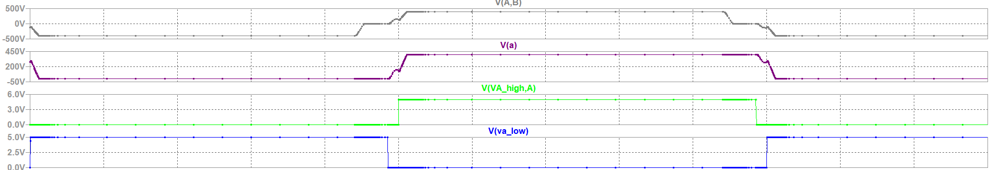

*Figure 1. Lagging-leg dead-time transition at 25% load. The switch-node voltage has not
reached the opposite rail before the incoming gate signal is asserted, so the device
turns on with voltage still across it.*

## 6. Simulation model

The model is a switching-level SPICE simulation of the complete converter: four MOSFETs
(M1 to M4) with body diodes and output capacitance, a coupled transformer (L1 and L2,
K = 0.999999) at 22:1, 4 uH of series leakage inductance (L3), a 0.4 uH output inductor
(L4), about 1500 uF of output capacitance with 3 mΩ ESR, and a full-bridge secondary
rectifier (D1 to D4) fed by a single secondary winding. Only the load resistor and the
phase shift change between load points.

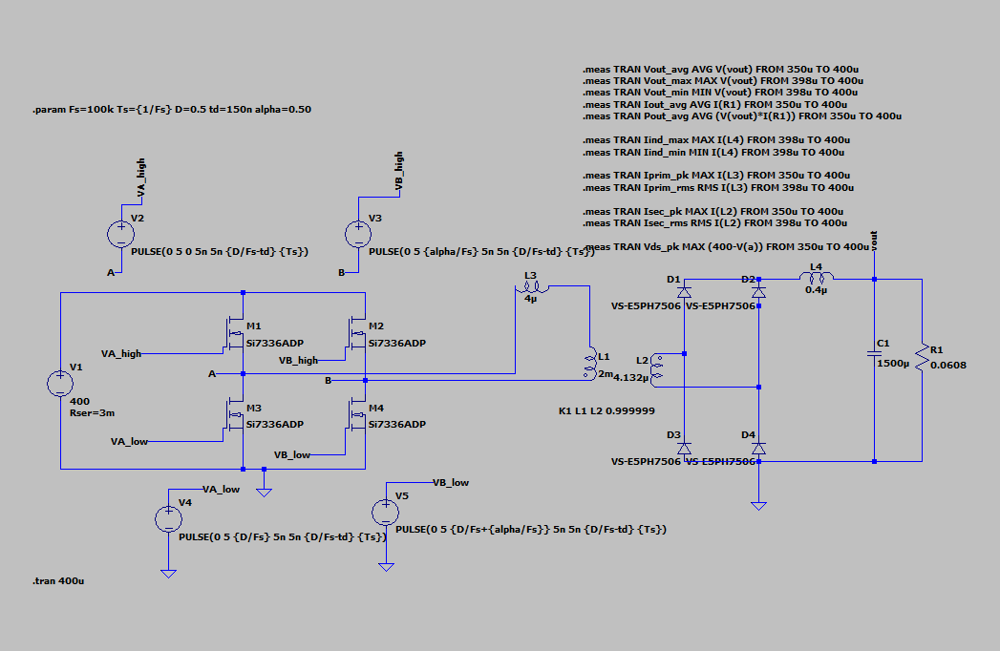

*Figure 2. The SPICE schematic behind every result in this report. H-bridge M1 to M4
with gate drives V2 to V5 (Leg A = M1/M3, Leg B = M2/M4), leakage inductance L3 in
series with the coupled transformer L1/L2, and the full-bridge secondary rectifier D1 to
D4 feeding output filter L4/C1 and load R1. The .meas directives at top right produce
the measurements collected in the results table.*

Low-forward-voltage diodes stand in for gated synchronous MOSFETs on the secondary. A
real build needs synchronous rectification at this output current. The simplification
shifts the absolute output voltage slightly through the extra forward drop but does not
change the switching behaviour being studied.

## 7. Simulation results

Figure 3 shows startup and steady state together at full load. The output voltage
settles after the initial transient, the output inductor current shows the expected
triangular ripple riding on the DC load current, and both transformer currents show the
characteristic PSFB pattern of a power-transfer interval followed by a freewheeling
interval each half-cycle, with the secondary scaled by the 22:1 ratio.

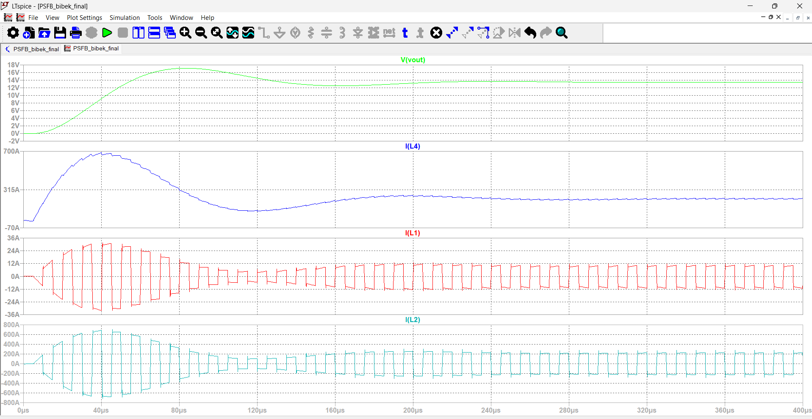

*Figure 3. 100% load: output voltage, output inductor current, primary transformer
current and secondary transformer current, from power-on through 400 us.*

Simulated output voltage at full load is about 13.31 V to 13.45 V depending on the
averaging window, close to the 13.5 V target, with output current correspondingly near
the rated 222 A. The small gap to exactly 13.5 V comes from the diode forward drops and
bus series resistance in the model, neither of which appears in the idealised hand
calculation.

### ZVS verification

Figures 4 to 6 verify ZVS directly at all three load points by plotting primary current
together with the drain-source voltage of both switches on each leg, over a couple of
full switching periods. The bridge-leg node voltages give both devices' V_ds directly:
400 minus the node voltage for the top switch, the node voltage itself for the bottom.

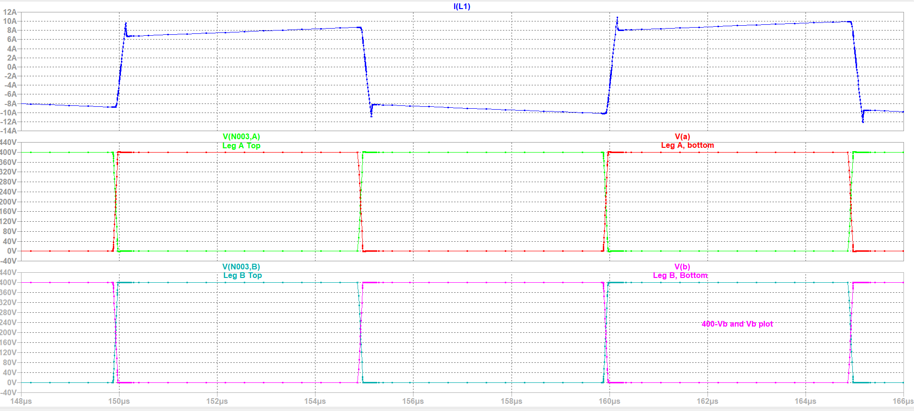

*Figure 4. 100% load, one switching period: primary current (top), Leg A (lagging)
switch voltages (middle), Leg B (leading) switch voltages (bottom). Every transition
reaches the opposite rail before the incoming gate is asserted, so every device turns on
into zero volts.*

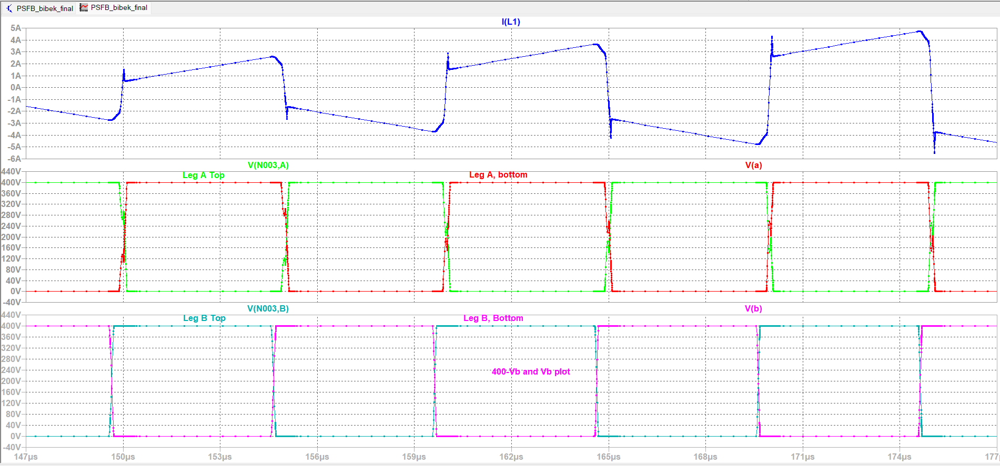

*Figure 5. 50% load, same traces as Figure 4. Both legs still complete their transitions
before turn-on, so ZVS is retained on both.*

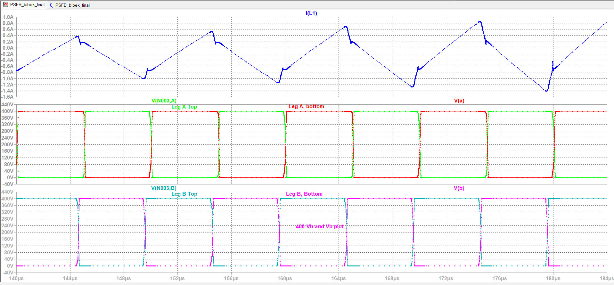

*Figure 6. 25% load, same traces at a finer time scale. The leading leg (bottom) still
transitions cleanly, but the lagging leg (middle) no longer completes its swing before
turn-on, consistent with the dead-time detail in Figure 1.*

Together these three figures are the waveform-level evidence for the central ZVS claim.
The leading leg holds ZVS across the full load range. The lagging leg loses it once the
load, and therefore the leakage current available during its transition, drops far
enough.

## 8. Load and performance analysis

### 8.1 Load analysis

I evaluated the converter at the three required load points by setting the load resistor
and retuning the phase shift until the output settled near 13.5 V.

| Load | Power | Resistance | Phase shift |
|---|---|---|---|
| 25% | 750 W | 0.243 Ω | 0.455 |
| 50% | 1500 W | 0.1215 Ω | 0.47 |
| 100% | 3000 W | 0.0608 Ω | 0.50 |

**100% load**

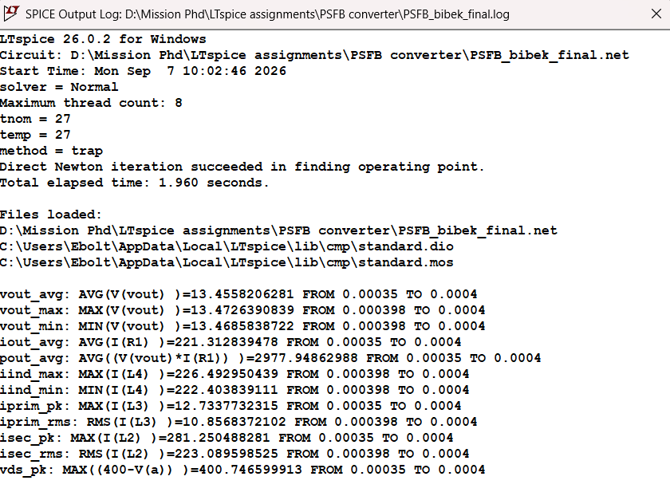

*Figure 7. 100% load, .meas output log: output voltage, current and power, inductor
current, primary and secondary currents (peak and RMS), and peak primary switch voltage,
sampled over the last two switching periods.*

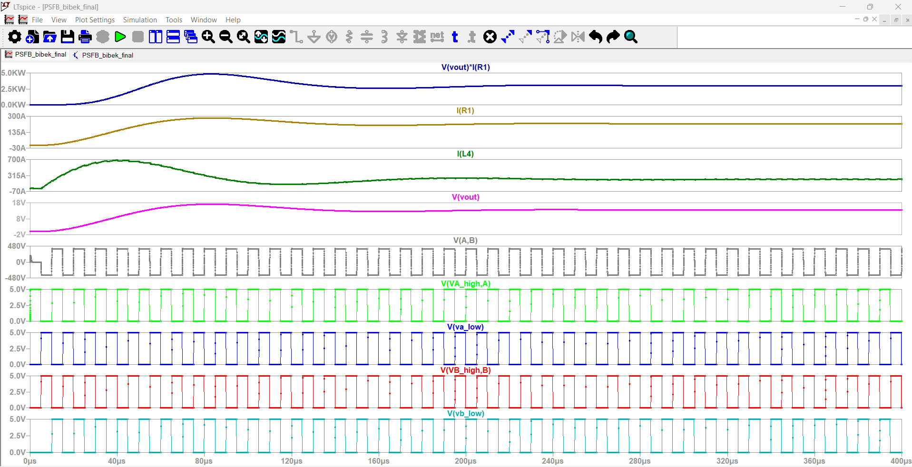

*Figure 8. 100% load, full run to 400 us: output power, output current, inductor current,
output voltage, primary voltage and all four gate signals.*

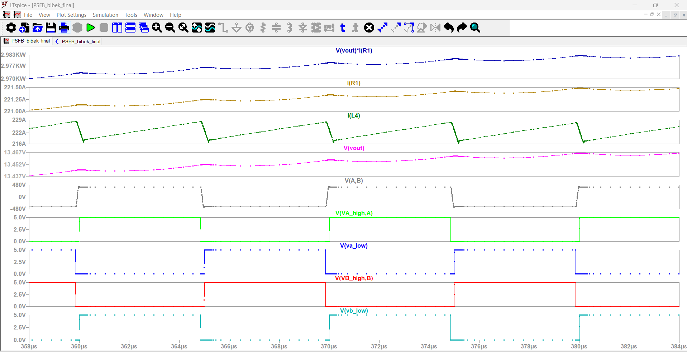

*Figure 9. 100% load, steady-state detail from 358 to 384 us, showing the
switching-period ripple once the startup transient has settled.*

**50% load**

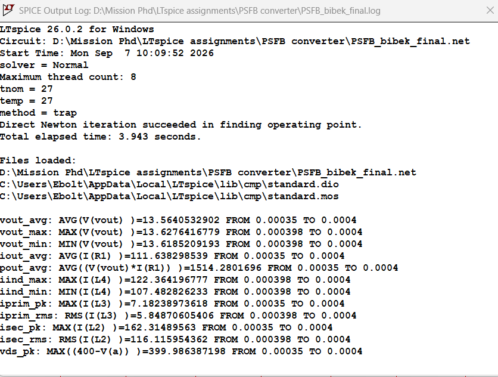

*Figure 10. 50% load, .meas output log, same measurement set as Figure 7.*

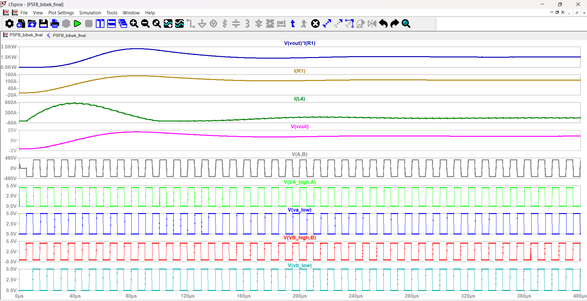

*Figure 11. 50% load, full run to 400 us, same traces as Figure 8.*

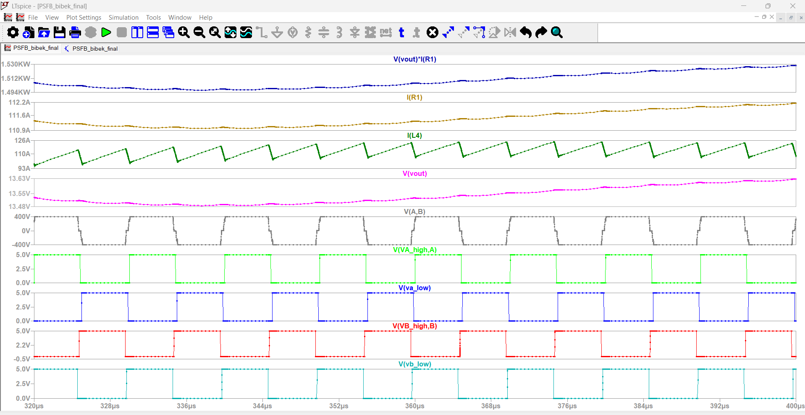

*Figure 12. 50% load, steady-state detail from 320 to 400 us.*

**25% load**

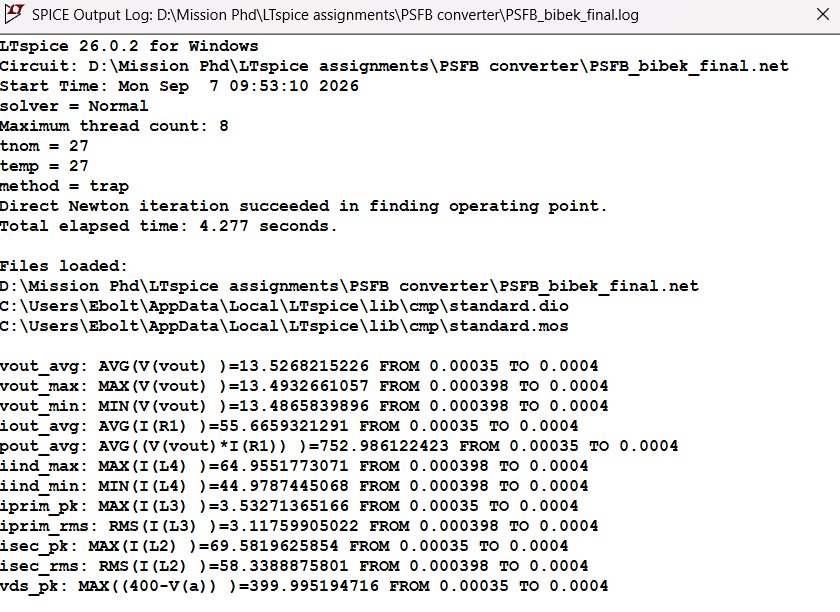

*Figure 13. 25% load, .meas output log, same measurement set as Figures 7 and 10.*

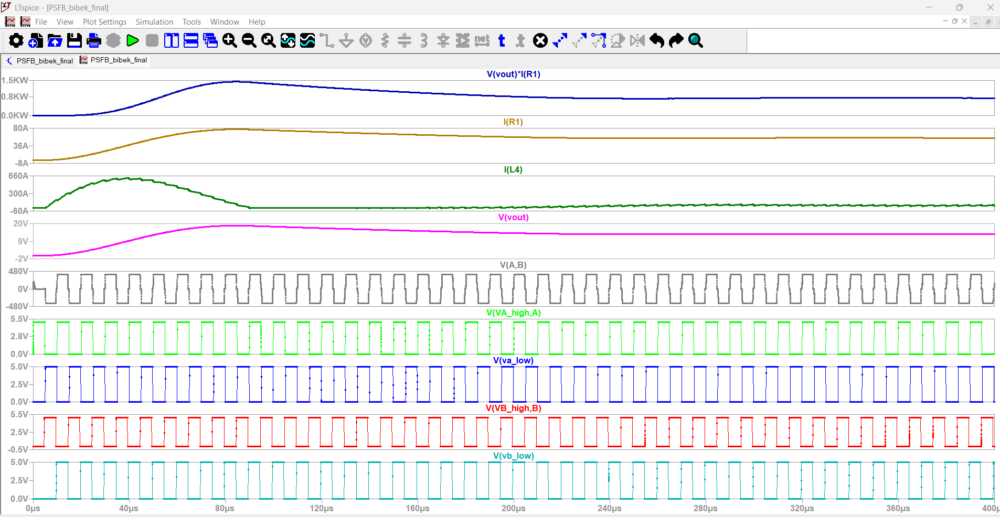

*Figure 14. 25% load, full run to 400 us, same traces as Figures 8 and 11.*

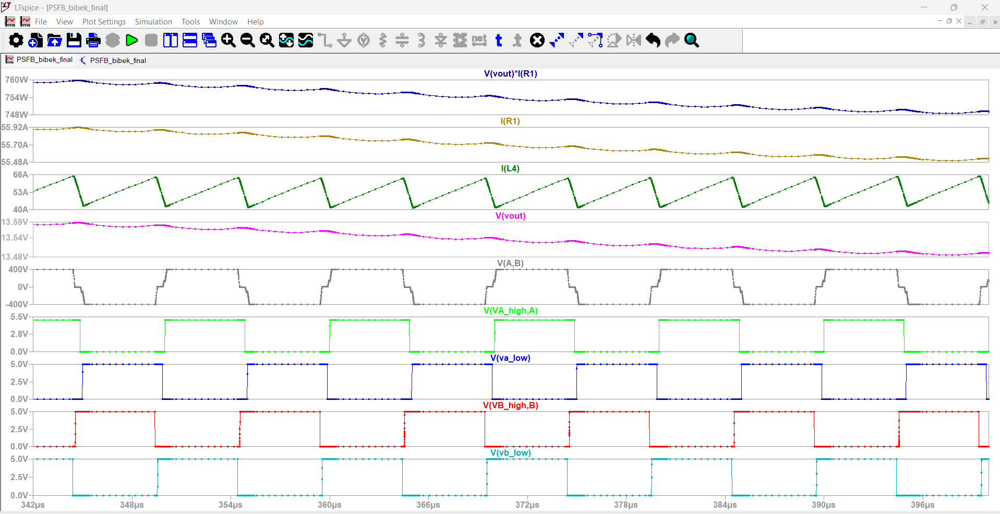

*Figure 15. 25% load, steady-state detail from 342 to 396 us.*

**Measured results across all three load points**

| Parameter | 25% load | 50% load | 100% load |
|---|---|---|---|
| Output power | 752 W | 1514 W | 2977 W |
| Average output voltage | 13.52 V | 13.56 V | 13.45 V |
| Output current | 55.66 A | 111.63 A | 221.31 A |
| Output voltage ripple | 6.70 mV | 9.12 mV | 4.01 mV |
| Inductor current ripple | 19.97 A | 14.88 A | 4.09 A |
| Peak primary current | 3.53 A | 7.18 A | 12.73 A |
| RMS primary current | 3.12 A | 5.85 A | 10.85 A |
| Peak secondary current | 69.58 A | 162.31 A | 281.25 A |
| RMS secondary current | 58.33 A | 116.11 A | 223.09 A |
| Maximum primary V_ds | 399.99 V | 399.98 V | 400.74 V |
| Leading leg ZVS | Yes | Yes | Yes |
| Lagging leg ZVS | No | Yes | Yes |

### 8.2 Performance analysis

**Output ripple.** Measured ripple is far below the 135 mV target at every load point.
The worst case is about 9.1 mV at 50% load, with the other two under 7 mV. That is the
1500 uF low-ESR bank and the 0.4 uH inductor working together. Sitting this far under
target signals real margin to reduce output capacitance in a later iteration if board
area or cost start to bind.

**Semiconductor stress.** Primary MOSFET voltage stays clamped at the bus across all
three load points, between 399.98 V and 400.74 V, which is only 0.2% of overshoot and
unusually clean. The secondary is the demanding side. At full load the peak secondary
current is about 281 A and the RMS is about 223 A. The peak-to-RMS ratio near 0.8
reflects the roughly square conduction pulse each device carries for close to half of
every switching period. That RMS figure is what should drive synchronous MOSFET
selection.

Blocking voltage on the secondary is more relaxed. Each device blocks about 18.2 V
against a 30 V rating, roughly 1.65 times margin. That is workable but not generous, and
it assumes secondary ringing is controlled. The primary-side overshoot in simulation is
very clean, but a real secondary layout with 222 A commutating through it will not be,
so an RC snubber across each rectifier position should be budgeted for.

**Circulating current.** During the freewheeling interval, current keeps circulating
through the primary bridge even though no useful voltage is applied to the transformer.
Figures 4 to 6 show it as the current trace continuing to ramp rather than dropping to
zero through the flat portion of the switch-node waveforms. This current still produces
conduction loss in the switches and winding while transferring no power, and it becomes
proportionally worse at light load.

**ZVS operation.** The leading leg achieves ZVS everywhere. The lagging leg achieves it
at 50% and 100% load and loses it at 25%. The useful check is whether the hand analysis
predicts this using the real 860 pF figure. It does:

| Load | I_prim at transition | vs 4.6 A | vs 8.3 A | Simulated result |
|---|---|---|---|---|
| 100% | 12.73 A | 2.8x above | 1.5x above | ZVS, both legs |
| 50% | 7.18 A | 1.6x above | 0.9x, marginal | ZVS, both legs |
| 25% | 3.53 A | 0.8x, below | 0.4x, below | Lagging leg hard-switched |

Full load clears both criteria and shows unambiguous ZVS. Quarter load fails both and
shows unambiguous hard switching on the lagging leg. Half load sits between them, above
the charge bound and just below the energy bound, and achieves ZVS with visibly less
margin than full load. That the analysis and the waveforms agree on all three points,
and contradict each other nowhere, is the strongest evidence here that the ZVS mechanism
is modelled correctly rather than just asserted.

What this means for the design, rather than the model, is worth being clear about. The
converter is not comfortably soft-switched down to 25% load. It is soft-switched down to
somewhere near 40%, and the 50% operating point sits closer to that boundary than a
production design would want.

## 9. Loss and efficiency estimate

### 9.1 How many secondary devices are needed

The secondary carries 223 A RMS. In a full-bridge rectifier two devices conduct in
series at any instant, so:

```
P_sec = 2 x I_sec,rms^2 x R_DS(on)
```

With one Si7336ADP per position that is 239 W at 25 °C, and a MOSFET dissipating that
much will not stay at 25 °C. On-resistance for a silicon device of this class rises
roughly 50% by 125 °C, pushing it to 358 W. Against a 3 kW output that is twelve percent
of output power lost in four transistors, which is thermal runaway rather than a design
point.

The current rating says the same thing more bluntly. Each position would see 158 A RMS
against a 30 A continuous rating, a factor of five over. The Si7336ADP is the right kind
of part for this job, but one per position is nowhere near enough silicon.

| Devices per position | Effective R_DS(on) | RMS per device | P_sec at 125 °C | Verdict |
|---|---|---|---|---|
| 1 | 2.40 mΩ | 158 A | 358 W | 5x over rating |
| 2 | 1.20 mΩ | 79 A | 179 W | over rating |
| 4 | 0.60 mΩ | 39 A | 90 W | over rating |
| 6 | 0.40 mΩ | 26 A | 60 W | at rating |
| **8** | **0.30 mΩ** | **20 A** | **45 W** | **workable** |
| 12 | 0.20 mΩ | 13 A | 30 W | better, more area |

Eight per position is the smallest count that keeps each transistor inside its current
rating with real margin and holds secondary conduction loss to about 1.5% of output
power. That is 32 MOSFETs on the secondary. It is worth stating plainly, because it is
the honest consequence of a 222 A output and it drives PCB layout, gate-drive design and
converter cost far more than anything on the 400 V side.

### 9.2 Loss budget at rated load

This budget assumes eight Si7336ADP per secondary position and a 650 V superjunction
MOSFET on the primary, since the 30 V part cannot be used there. A representative 70 mΩ
device is assumed for the primary, derated for temperature.

| Loss mechanism | Value | Basis |
|---|---|---|
| Secondary conduction | 44.8 W | 32 devices, 0.30 mΩ effective, hot |
| Primary conduction | 28.1 W | 4 devices at 119 mΩ hot |
| Secondary body-diode conduction | 8.8 W | SR dead time, about 100 ns per transition |
| Primary turn-off switching | 5.1 W | turn-on loss near zero under ZVS |
| Secondary gate drive | 1.2 W | 32 devices, 36 nC, 10 V, 100 kHz |
| Primary gate drive | 0.3 W | 4 devices |
| **Total semiconductor loss** | **88.3 W** | |

```
eta = 2978 / (2978 + 88.3) = 97.1%
```

Two things stand out. The secondary still dominates even after paralleling eight devices
into every position, accounting for 55 W of the 88 W total. That is the 222 A output
asserting itself, and it is why this converter is fundamentally a secondary-side
engineering problem.

The body-diode term also deserves more attention than 8.8 W suggests. That loss exists
only because the synchronous rectifiers are held off for about 100 ns around each
transition, during which output current commutates through body diodes dropping roughly
a volt apiece. It scales directly with SR dead time, so sloppy gate timing is an easy way
to give back several times that figure without anything looking obviously wrong on a
scope.

### 9.3 The light-load penalty

At 25% load the lagging leg hard-switches, so the energy stored in the device output
capacitance is dumped into the channel at every turn-on instead of being recovered:

```
P_hard = 2 x (0.5 C_oss V_in^2) x f_s = 2 (68.8 uJ)(100 kHz) = 13.8 W
```

Against a 753 W output that is 1.8% of output power, appearing as pure added loss
exactly where the converter can least afford it. It also lands as localised heating in
two devices rather than spread across the bridge.

### 9.4 What this estimate leaves out

The 97.1% figure covers semiconductors only and should be read as an upper bound rather
than a prediction. The SPICE model uses ideal windings, so it captures none of the
magnetics loss, and at 223 A and 100 kHz that omission is not small. A secondary winding
resistance of even half a milliohm would add 25 W on its own, and skin and proximity
effects at 100 kHz push effective AC resistance well above the DC value. Core loss, PCB
and interconnect resistance, and output capacitor ESR loss are all absent too.

A realistic full-load efficiency once magnetics are included would more plausibly land in
the low to mid 90s. Closing that gap needs a real transformer and inductor design with
measured winding resistances.

## 10. Conclusion

The converter was designed for 400 VDC in, 13.5 VDC out, 3 kW, using 100 kHz switching,
a 22:1 transformer, 0.4 uH of output inductance, about 1500 uF of output capacitance,
4 uH of leakage inductance and 150 ns of dead time. Calculation and simulation together
show it holds about 13.5 V across the required load range, with ZVS on both legs at 50%
and 100% load and lost only on the lagging leg at 25%.

Turns ratio and leakage inductance are coupled choices rather than independent ones,
since the duty budget has to absorb the duty loss the leakage inductance introduces. The
dominant challenge, though, is the secondary current. At 3 kW and 13.5 V the output is
more than 220 A, which is why secondary conduction loss, transformer winding resistance
and output inductor construction matter more to the final design than anything on the
400 V side.

Working the loss budget with real datasheet parameters changed two conclusions. The
secondary needs about eight paralleled devices per rectifier position, not one. And the
ZVS margin is tighter than a generic capacitance assumption suggested, with the practical
ZVS floor sitting nearer 40% load than 25%. Neither changes the topology or the
power-stage values, but both change what a real build would need.

### Possible improvements

- Raise the dead time from 150 ns to about 200 ns. The transition takes roughly 130 ns
  with the real output capacitance, so 15% margin is thinner than it should be once
  gate-driver delay mismatch and part-to-part spread are included.
- Select the primary devices properly. The 30 V part currently in the simulation
  schematic cannot survive a 400 V bus. A 650 V superjunction MOSFET should replace it,
  and the ZVS analysis rerun with its much smaller output capacitance.
- Add an auxiliary ZVS-assist circuit, or use asymmetric dead time with a longer value on
  the lagging leg, to push ZVS below the 40% load floor without adding leakage inductance
  and its duty-cycle penalty at full load.
- Tighten the synchronous-rectifier gate timing. The 8.8 W of body-diode conduction
  scales directly with SR dead time and is one of the easier losses to reduce without
  changing a single component.
- Consider a current-doubler secondary. It conducts through one rectifier device at a
  time instead of two in series, which would roughly halve the secondary conduction
  voltage drop at this current level.
- Replace the open-loop operating points with a closed feedback loop and verify transient
  response to load and line steps.

## Repository contents

```
README.md           this document
figures/            the 15 LTspice captures, named by figure number
report/             the full write-up as .docx and .pdf
scripts/losses.py   ZVS threshold, paralleling study and loss budget
```

`scripts/losses.py` is standalone and reproduces every number quoted above. Run it with
`python scripts/losses.py`; it needs no inputs and no dependencies.

## References

Device data is from the [Vishay Si7336ADP datasheet](https://www.vishay.com/docs/73152/si7336adp.pdf)
(document 73152). Simulation performed in LTspice 26.0.2.
